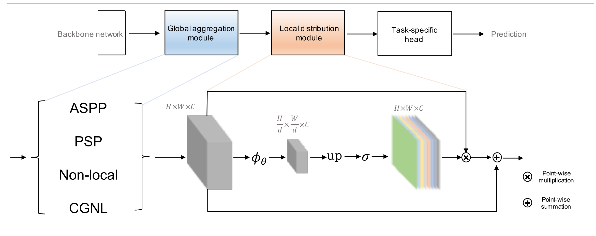
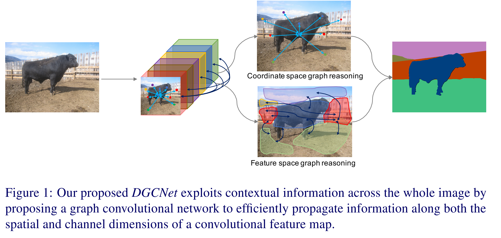

# GALD-Net & Dual-Seg Net （BMVC-2019）
This is pytorch re-implementation of GALD-net and Dual-Seg
Both paper are accepted by BMVC-2019 which achieves state-of-the-art results on Cityscapes and Pascal Context datasets.

There is also a co-current repo for Fast Road Scene Semantic Segmentation:[Fast_Seg :zap: ](https://github.com/lxtGH/Fast_Seg) and thanks for your attention :smiley:

## GALDNet


## DualGCNSegNet



# Training & Validation

## Requirement

pytorch >= 1.1.0
apex
opencv-python

## Training 
Note that we use apex to speed up training process. 
At least 8 gpus with 12GB are needed since we need batch size at least 8 and crop size at least 800 on Cityscapes dataset.
Please see the train_distribute.py for the details. 

```bash
sh ./exp/train_dual_seg_r50_city_finetrain.sh
```
You will get the model with 79.8 mIoU.

```bash
sh ./exp/train_dual_seg_r101_city_finetrain.sh
```
You will get the model with 80.4 mIoU.

## Validation

```bash
sh ./exp/tes_dualseg_r50_city_finetrain.sh
```

# Trained Model
model with fine dataset.  
Dual-Seg-net: 
    resnet-50:
    resnet-101:
model with coarse dataset pretrained.  


# Some Advices on Training
Please see the Common.md for the details.


## GALD-Net (BMVC 2019,[arxiv](https://arxiv.org/pdf/1909.07229.pdf))
We propose Global Aggregation then Local Distribution (GALD) scheme to distribute global information to each position adaptively according to the local information around the position. GALD net achieves **top performance** on Cityscapes dataset. Both source code and models will be available soon. The work was done at [DeepMotion AI Research](https://deepmotion.ai/) 

## DGCNet (BMVC 2019,[arxiv](https://arxiv.org/abs/1909.06121)) 
We propose Dual Graph Convolutional Network (DGCNet) models the global context of the input feature by modelling two orthogonal graphs in a single framework. (Joint work: University of Oxford, Peking University and DeepMotion AI Research)


##  Comparisons with state-of-the-art models on Cityscapes dataset 
Method | Conference | Backbone | mIoU(\%) 
---- | ---- | ---- | ----
RefineNet |  CVPR2017  | ResNet-101  |  73.6 
SAC  |  ICCV2017  | ResNet-101  |  78.1 
PSPNet |  CVPR2017  | ResNet-101  |  78.4
DUC-HDC | WACV2018 | ResNet-101 | 77.6 
AAF |   ECCV2018  | ResNet-101  |  77.1 
BiSeNet |   ECCV2018  | ResNet-101  |  78.9 
PSANet |  ECCV2018  | ResNet-101  |  80.1 
DFN  |  CVPR2018  | ResNet-101  |  79.3 
DSSPN | CVPR2018  | ResNet-101  | 77.8 
DenseASPP  |  CVPR2018  | DenseNet-161  |  80.6
OCNet| - |  ResNet-101 | 81.7 
CCNet| ICCV2019 | ResNet-101 | 81.4
GALD-Net | BMVC2019 | ResNet50 |**80.8**
GALD-Net | BMVC2019| ResNet101 |**81.8**
DGCN-Net | BMVC2019 | ResNet101 | **82.0**
GALD-Net(use coarse data) |BMVC2019 | ResNet101 |**82.9**
GALD-Net(use Mapillary)|BMVC2019 |ResNet101| **83.3**


## Detailed Results are shown 
GALD-Net:
[here](https://www.cityscapes-dataset.com/anonymous-results/?id=5ee0f5098e160aa56db6e9ed01c5fbc73d4ac736b6b61751b50ad31067b0d5bd)   
GFF-Net:[here](https://www.cityscapes-dataset.com/method-details/?submissionID=3719)  
Both are (**Single Model Result**)  


# Citation 
Please read our paper for model details. 
If you find the codebase usefull, please consider cite our paper.
```
@inproceedings{xiangtl_gald
title={Global Aggregation then Local Distribution in Fully Convolutional Networks},
author={Li, Xiangtai and Zhang, Li and You, Ansheng and Yang, Maoke and Yang, Kuiyuan and Tong, Yunhai},
booktitle={BMVC2019},
}
```

```
@inproceedings{zhangli_dgcn
title={Dual Graph Convolutional Network for Semantic Segmentation},
author={Zhang, Li(*) and Li, Xiangtai(*) and Arnab, Anurag and Yang, Kuiyuan and Tong, Yunhai and Torr, Philip HS},
booktitle={BMVC2019},
}
```

# License
MIT License


# Acknowledgement

Thanks to previous open-sourced repo:  
[Encoding](https://github.com/zhanghang1989/PyTorch-Encoding)    
[CCNet](https://github.com/speedinghzl/CCNet)   
[TorchSeg](https://github.com/ycszen/TorchSeg)  
[pytorchseg](https://github.com/meetshah1995/pytorch-semseg) 
